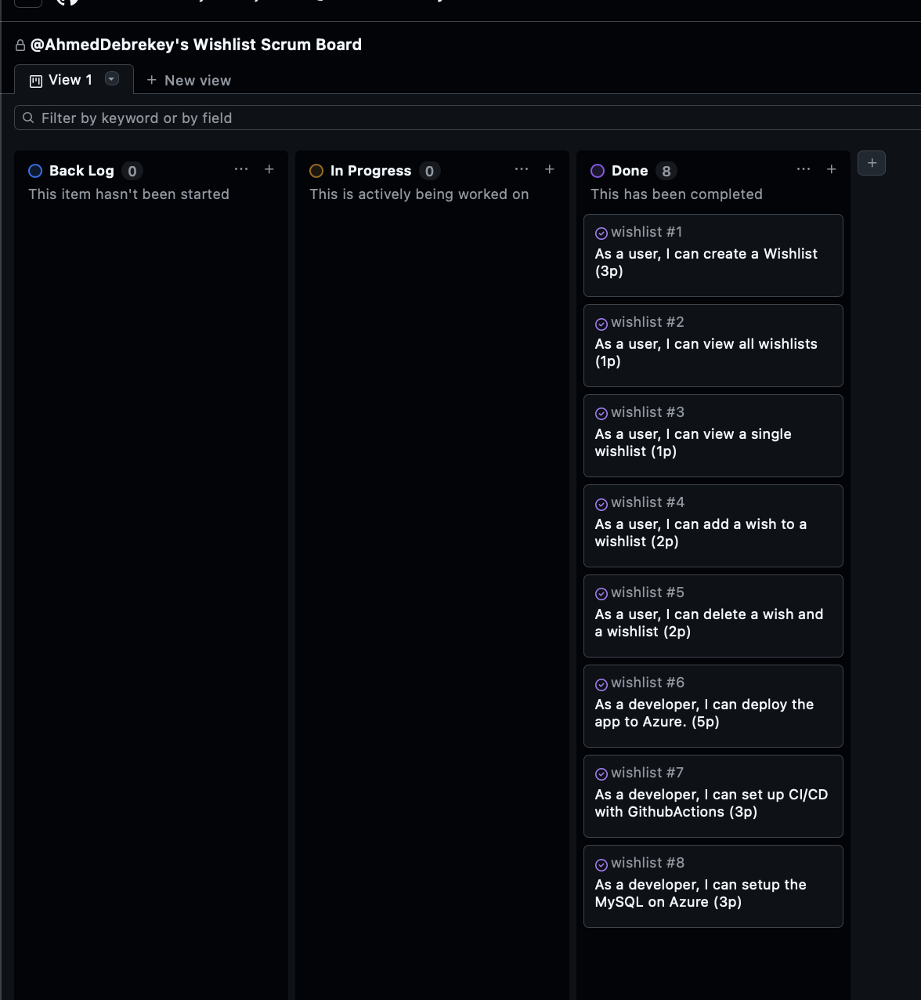

# Wishlist App
EK Mandatory project. Made by Ahmed El-Dabraky

## Demo
[https://wishlist-wa-a2g4cmf5duf5bnd7.germanywestcentral-01.azurewebsites.net](https://wishlist-wa-a2g4cmf5duf5bnd7.germanywestcentral-01.azurewebsites.net)

## Features
- Create a wishlist
- Add wishes
- Reserve wishes
- Delete wishlists and individua wishes
- CI/CD deployment via Github Actions

## Tech Stack
- Java 21
- Spring Boot
- Thymeleaf
- Maven
- MySQL
- Azure Webapp + Azure Database

## Scrum Board

## ER Diagram

## Class Diagram
